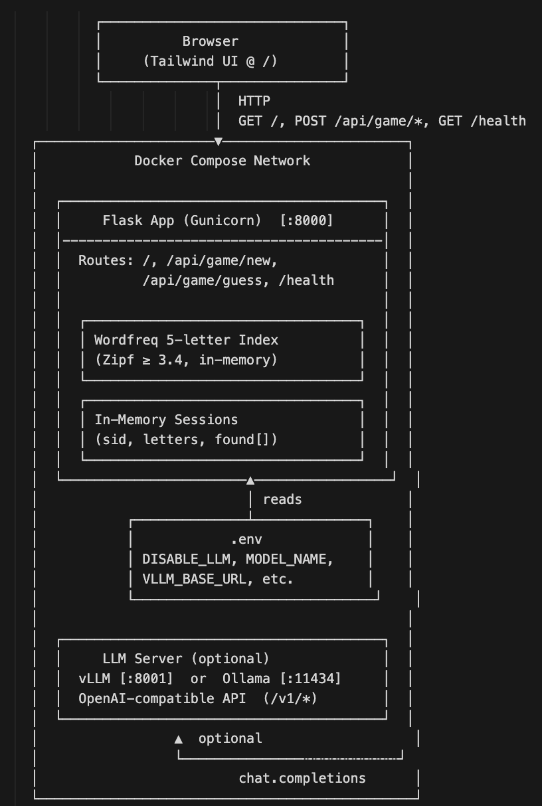
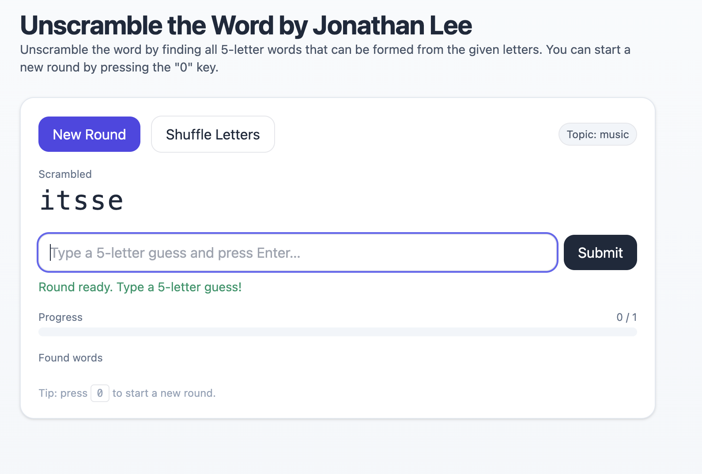

# Tiny Llama LLM Unscramble — 5-letter Words Anagram Game

A tiny, containerized Flask app. Each round gives you **exactly five letters**. The task is to find **5-letter words** made from those letters (often multiple anagrams: e.g., `stare → aster, rates, stare, taser, tears`).

---

## 1) Executive Summary

**Problem:** Many word games accept any sub-word length, which makes scoring noisy and gameplay unfocused. I wanted a simple, fair challenge: given exactly five letters, find only 5-letter words that can be formed from those letters. So, it’s not just one word that can be formed from the 5-letter word generated, but you can solve multiple words from those scrambled letters.

**Solution:** I built a small, containerized Flask app. Each round gives you exactly five letters. The task is to find 5-letter words made from those letters (often multiple anagrams: e.g., `stare → aster, rates, stare, taser, tears`).

---

## 2) System Overview

**Course Concept(s):**
- Containerization with Docker; env-based configuration  
- Web APIs with Flask + Gunicorn  
- LLM integration via OpenAI-compatible HTTP endpoint (vLLM)  
- Data filtering with frequency thresholds (Zipf) using `wordfreq`

**Architecture Diagram:**  

**Data / Models / Services:**
- **Dictionary:** `wordfreq` top-N English words, filtered to 5 letters, Zipf ≥ 3.4  
- **Source:** `wordfreq` Python package  
- **Size:** configurable (default top 50k)  
- **Format:** in-memory Python lists/dicts

**License:**
- **Web App:** Flask + Gunicorn (serves UI + JSON API)  
- **Licenses:** Flask (BSD-3), Gunicorn (MIT)  
- **Optional LLM:** TinyLlama 1.1B Chat via OpenAI-compatible server  
- **Serving:** vLLM (CUDA) or Ollama (CPU/Metal friendly)

> **Note:** app works without the LLM (offline fallback)

---

## 3) How to Run (Local)

- **Docker** single command (uses docker-compose.yml and .env)
- docker compose up --build
- UI: http://localhost:8000
- **Health (optional)**:
- curl http://localhost:8000/health

---

## 4) Design Decisions

**Why this concept?**  
Exactly-5-letters keeps rules and UX crystal-clear while still allowing multiple valid targets (classic anagram clusters like `stare → aster, rates, taser, tears, stare`). Optional LLM demonstrates model integration without making it a hard dependency (offline mode is default).

**Alternatives considered:**
- Subword game (≥3 letters): more variety but noisier gameplay and grading.  
- Static word list: simpler, but `wordfreq` with Zipf filtering better controls obscure words.

**Tradeoffs:**
- **Performance:** All validation is in-memory; fast for single-container use.  
- **Cost/Complexity:** LLM disabled by default to avoid GPU/CPU overhead; can be enabled if desired.  
- **Maintainability:** Minimal dependencies; env-driven config.

**Security/Privacy:**
- No PII collected; sessions are in-memory only.  
- Inputs validated (letters, length).  
- Secrets/config via `.env` (not committed).

**Ops (logs/metrics/limits):**
- Logs: Gunicorn/Flask standard output.

**Known limits:** vLLM requires NVIDIA GPU; use Ollama or offline mode on macOS.

---

## 5) Results & Evaluation

**Screenshots (place in `/assets` and embed):**  
  

---

**Sample outputs:**
# New round
curl -s -X POST http://localhost:8000/api/game/new | jq
# Guess
curl -s -X POST http://localhost:8000/api/game/guess \
  -H 'Content-Type: application/json' \
  -d '{"session_id":"<SID>","guess":"stare"}' | jq

---

**Performance footprint:**
- Game container: lightweight (Flask + `wordfreq`).

**Validation/tests performed:**
- Health endpoint check (`/health`).  
- Round creation and guess cycle via curl smoke tests.  
- Manual UI testing: new round, shuffle, guess, completion state.

---

## 6) What’s Next

- “Reveal one” hint button that surfaces a remaining anagram.  
- Scoreboard (time to complete, % found).  
- Daily challenge with a fixed seed.

---

## 7) Links (Required)

**GitHub Repo:** https://github.com/jlee0325/unscramble
